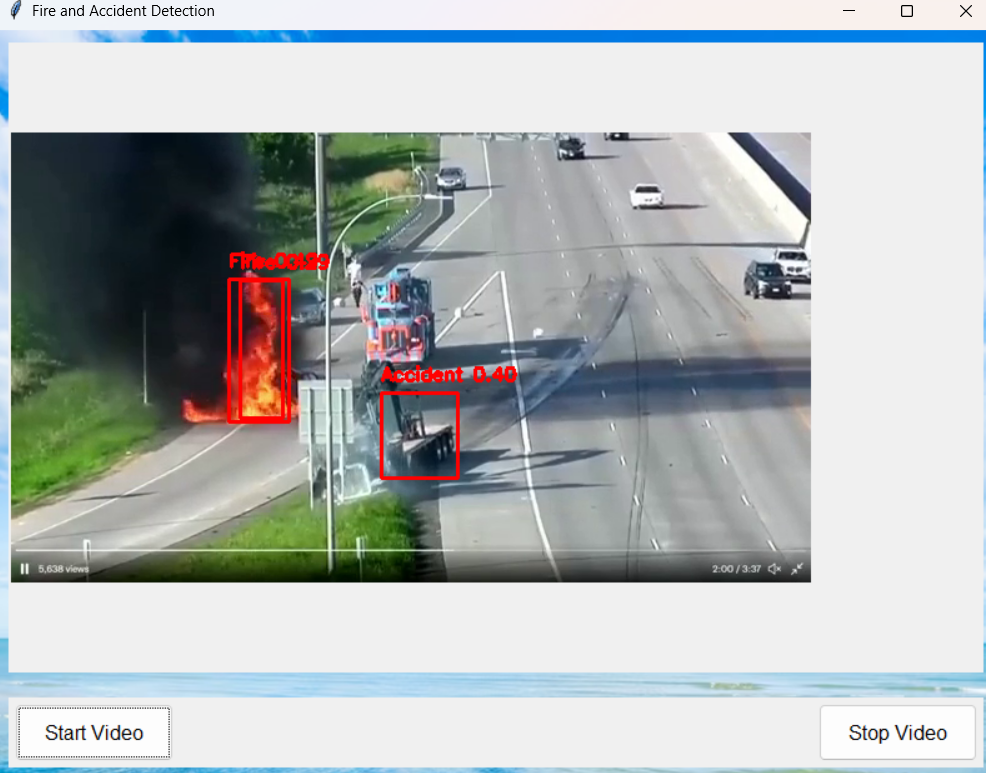
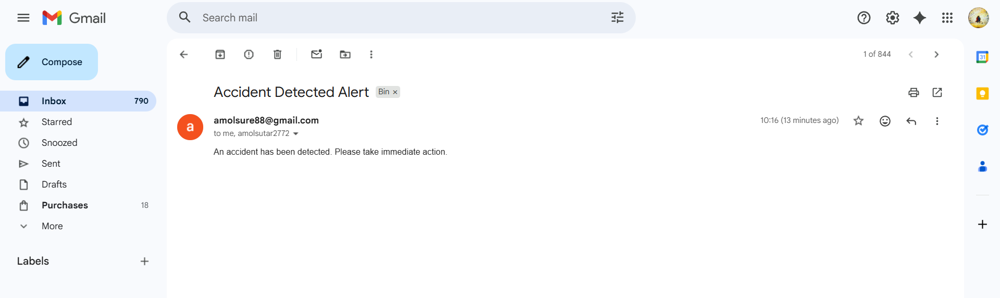

# Real Time Accident Detection And Alert System

This project detects **Fire 🔥** and **Accidents 🚗** in real-time video streams using **YOLOv8** and sends **automated alert emails** to emergency departments — Fire Brigade, Police, and Hospital.

---

## 🎯 Project Overview

This system uses **two independent YOLOv8 models** — one trained on a *Fire/Smoke dataset* and another on an *Accident dataset*.  
It detects both hazards simultaneously through a **Tkinter GUI**, processes video streams in real-time, and triggers **email alerts** using Gmail’s SMTP service.

---

## 🧩 Model Performance Results

| Model | Precision | Recall | mAP50 | mAP50-95 | Results Folder |
|--------|------------|---------|--------|-----------|----------------|
| **Fire Detection** | 0.6115 | 0.5359 | 0.5468 | 0.2559 | `runs/detect/val13` |
| **Accident Detection** | 0.8910 | 0.8329 | 0.9137 | 0.6636 | `runs/detect/val14` |

✅ Both models demonstrate reliable and real-time capable performance.

---

## 🧠 Features

- **Dual YOLOv8 Models:** Independent detection for Fire & Accident  
- **Real-time Detection:** Fast inference on live CCTV or recorded videos  
- **Email Alert System:** Sends instant alerts to Fire Brigade, Police & Hospital  
- **Tkinter GUI:** User-friendly desktop interface  
- **Parallel Processing:** Fire & Accident models run concurrently  
- **Performance Evaluation:** Automatically prints model accuracy before GUI launch  

---

## 🧪 Training Summary

### 🔥 Fire Detection Model
- **Dataset:** Custom dataset with `fire` and `smoke` classes  
- **Images:** 895 (with 105 background images)  
- **Instances:** 1443 labeled fire/smoke objects  
- **Training Time:** ~1.5 hours on RTX 3050  
- **Results:**  
  - Precision: 0.6115  
  - Recall: 0.5359  
  - mAP50: 0.5468  
  - mAP50-95: 0.2559  
- **Results Folder:** `C:\Users\Amol\runs\detect\val13`

### 🚗 Accident Detection Model
- **Dataset:** Custom road accident dataset  
- **Images:** 2974 (213 backgrounds)  
- **Instances:** 3208 accident cases  
- **Training Time:** ~2 hours on RTX 3050  
- **Results:**  
  - Precision: 0.8910  
  - Recall: 0.8329  
  - mAP50: 0.9137  
  - mAP50-95: 0.6636  
- **Results Folder:** `C:\Users\Amol\runs\detect\val14`

---

## 🧰 Tech Stack

| Category | Technology |
|-----------|-------------|
| **Programming Language** | Python 3.11 |
| **Object Detection Framework** | YOLOv8 (Ultralytics) |
| **Deep Learning Backend** | PyTorch |
| **GUI Framework** | Tkinter |
| **Computer Vision Library** | OpenCV |
| **Email Service** | Gmail SMTP |
| **Image Handling** | Pillow (PIL) |
| **Hardware Used** | NVIDIA GeForce RTX 3050 Laptop GPU (4GB VRAM) |
| **Operating System** | Windows 11 |

---

## 🖥️ GUI Preview

| Fire and Accident Detection GUI | Email Alert Example |
|--------------------------------|---------------------|
|  |  |

---

## ⚙️ Installation Guide

### 1️⃣ Clone the repository
```bash
git clone https://github.com/<your-username>/Fire-and-Accident-Detection.git
cd Fire-and-Accident-Detection
